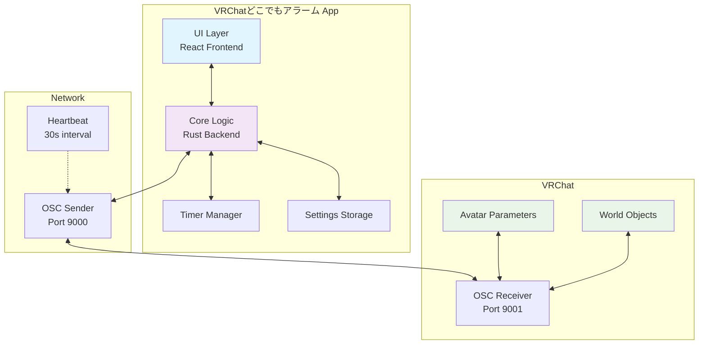
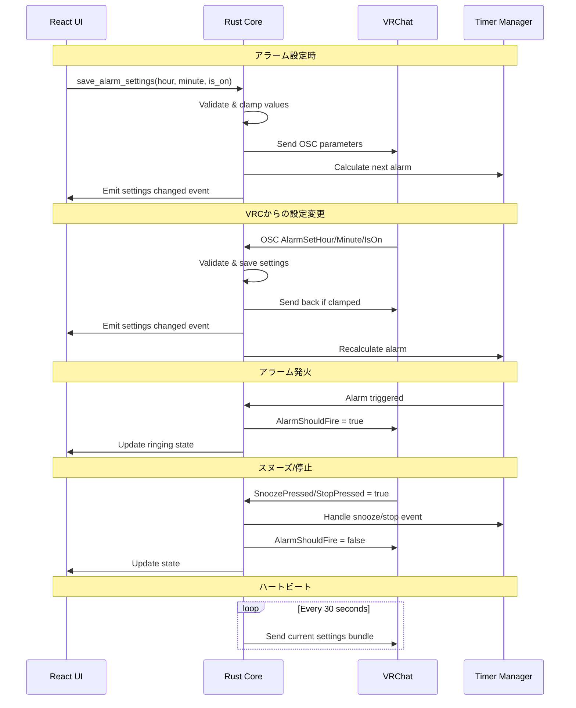
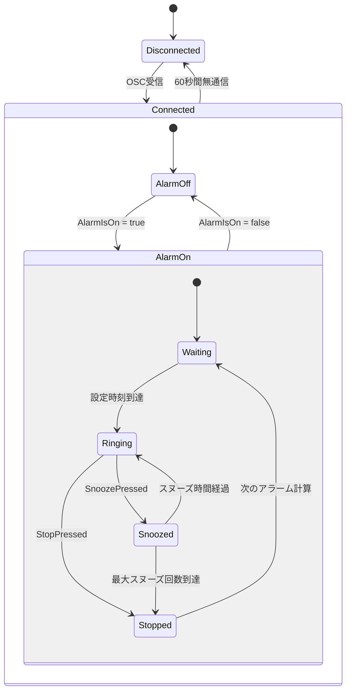

# VRChatどこでもアラーム

VRChat内でアラーム機能を提供するOSCアプリケーション

## 機能

- VRChat内でアラーム時刻の設定・変更
- アラームのオン/オフ切り替え
- スヌーズ機能（最大20回まで設定可能）
- VRChatとリアルタイム同期
- 自動アップデート通知

## 動作環境

- Windows 10/11
- VRChat（OSC機能有効）

## セットアップ

1. [Releases](https://s-akagi0610.booth.pm/)から最新版をダウンロード
2. VRChatでOSC機能を有効化
3. アプリケーションを起動

## 使用方法

1. アプリケーション起動後、VRChatと自動的に接続
2. VRChat内のアバターパラメータでアラーム設定
3. 設定は自動的にアプリと同期

## 開発者向け連携仕様

本ツールはVRChat向けアラーム機能のコア機能を提供します。アバター制作者やワールド制作者は以下のOSCパラメータを活用して時計やアラーム表示を作成できます。

### OSCパラメータ仕様

| パラメータ名 | 型 | 方向 | 説明 |
|------------|----|----|-----|
| AlarmSetHour | Float | 双方向 | アラーム時間（0-1の範囲、0=0時、1=23時） |
| AlarmSetMinute | Float | 双方向 | アラーム分（0-1の範囲、0=0分、1=59分） |
| AlarmIsOn | Bool | 双方向 | アラーム有効/無効状態 |
| SnoozePressed | Bool | VRC→App | スヌーズボタンの押下状態 |
| StopPressed | Bool | VRC→App | 停止ボタンの押下状態 |
| AlarmShouldFire | Bool | App→VRC | アラーム発火中の状態 |

### 活用例

#### 時計表示の実装
```
AlarmSetHour × 23 = 表示時間（整数部分）
AlarmSetMinute × 59 = 表示分（整数部分）
AlarmIsOn = ON/OFF表示の切り替え
```

## システム構成図



## データフロー図



## 状態管理図



## ライセンス

MIT License

## 免責事項

本ソフトウェアはVRChatの非公式ツールです。VRChat Inc.とは関係ありません。